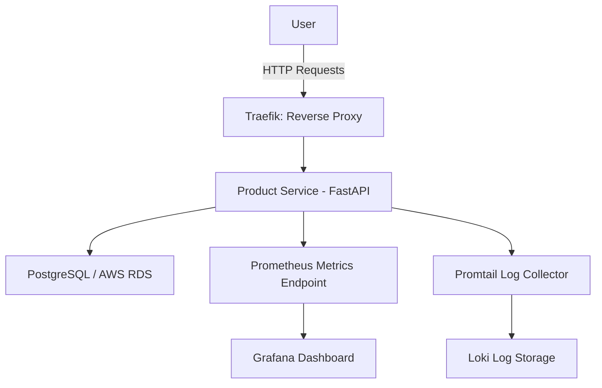

# 🐳 DevOps Infrastructure for E-Commerce  


> Complete **microservices-based DevOps environment** for an e-commerce application, featuring observability, logging, and reverse proxy management.  
> Designed as a **portfolio-grade infrastructure project** to demonstrate cloud-ready container orchestration, metrics monitoring, and deployment scalability.  
> ☁️ Locally deployed via **Docker Compose**, with partial deployment and validation on **AWS ECS Fargate**.

---

## 📘 Overview
This project delivers a **full DevOps ecosystem** that simulates a production-grade e-commerce backend.  
It integrates **containerized microservices**, **real-time monitoring**, and **centralized logging**, providing a solid foundation for future cloud deployments.

The stack was first built and validated locally using **Docker Compose**, and later extended to **AWS ECS Fargate** with **ECR**, **RDS (PostgreSQL)**, and **Application Load Balancer (ALB)** for cloud infrastructure testing.

---

## 🧰 Technologies

### **Core Services**
| Service | Purpose |
|----------|----------|
| **Traefik** | Reverse proxy and dynamic routing for internal services. |
| **FastAPI (Product Service)** | REST API simulating product management in an e-commerce application. |
| **PostgreSQL** | Relational database for product data persistence (local + AWS RDS). |

### **Observability Stack**
| Tool | Purpose |
|------|----------|
| **Prometheus** | Scrapes and aggregates metrics from application and infrastructure. |
| **Grafana** | Visualizes metrics and logs through custom dashboards. |
| **Loki** | Centralized log aggregation and indexing. |
| **Promtail** | Log shipper for containerized environments. |

### **Cloud Integration**
| AWS Service | Role |
|--------------|------|
| **ECR** | Private image registry for container deployments. |
| **ECS Fargate** | Serverless container orchestration. |
| **RDS PostgreSQL** | Managed database for persistent storage. |
| **ALB (Application Load Balancer)** | Public endpoint routing traffic to ECS services. |

---

## 🧱 Architecture

The infrastructure combines a **local Docker Compose environment** for full observability and testing with a **cloud-ready deployment model** on AWS.  
Each microservice communicates through an internal network, managed by Traefik and monitored through Prometheus and Grafana.


---

## ⚙️ Implementation Steps

### **1️⃣ Local Development and Orchestration**
- Defined the multi-service architecture (`product-service`, `db-product`, `prometheus`, `grafana`, `loki`, `promtail`, `traefik`).
- Created Dockerfiles for modular containerization.
- Orchestrated services using **Docker Compose** with internal networking and health checks.

### **2️⃣ Observability Integration**
- Configured **Prometheus** to scrape metrics from FastAPI endpoints (`/metrics`).
- Deployed **Grafana** dashboards for live CPU, latency, and request metrics.
- Integrated **Loki + Promtail** for centralized log collection and querying.

### **3️⃣ Reverse Proxy with Traefik**
- Dynamic routing rules via container labels.  
- **Load balancing and automatic service discovery** across internal containers.

### **4️⃣ Cloud Deployment (AWS ECS)**
- Built and pushed container images to **Amazon ECR**.
- Deployed **ECS Fargate service** using those images.
- Configured environment variables, IAM roles, and log streams to **CloudWatch**.
- Connected the application to an **AWS RDS PostgreSQL** instance for persistent storage.
- Integrated an **Application Load Balancer (ALB)** for external access.

### **5️⃣ Current Status**
- All services successfully run in the local Docker environment with full observability.  
- AWS stack validated up to ECS + RDS connectivity stage.  
- Remaining limitation: ECS task networking in private subnet (timeout reaching RDS).  
  > _This issue is purely infrastructural —in a full VPC setup with proper routing and SG pairing, the system would be fully operational._

---

## 🧩 Local Service Access

| Service | URL | Description |
|----------|-----|-------------|
| **Product API** | [http://localhost:8080/products](http://localhost:8080/products) | REST endpoint for product management. |
| **Prometheus** | [http://localhost:9090/targets](http://localhost:9090/targets) | Metrics collection interface. |
| **Grafana** | [http://localhost:3000](http://localhost:3000) | Dashboards and visualization (user: admin / pass: admin). |
| **Traefik Dashboard** | [http://localhost:8081](http://localhost:8081) | Proxy and routing visualization. |
| **Loki API** | [http://localhost:3100](http://localhost:3100) | Centralized logs backend. |

---

## 📊 Metrics and Logging

- **Prometheus**: collects `/metrics` from FastAPI.  
- **Grafana**: provides real-time insights on request rates, latencies, and resource usage.  
- **Loki + Promtail**: aggregate structured logs from all containers, accessible in Grafana *Explore*.

---

## ☁️ AWS Deployment Summary

| Resource | Configuration |
|-----------|---------------|
| **ECR** | Repository for `product-service` image. |
| **ECS Fargate** | Task running containerized FastAPI application. |
| **RDS PostgreSQL** | Managed database for production persistence. |
| **ALB** | Exposes ECS service through port 80 (HTTP). |
| **CloudWatch Logs** | Centralized logging for ECS tasks. |

> Note: ECS deployment completed successfully with full service orchestration.  
> Connection between ECS and RDS timed out due to private subnet isolation.  
> The architecture and IAM roles are correctly defined for full production readiness.

---

## 🚀 Usage

```bash
git clone https://github.com/IsaacRomanSerrano/ecommerce-devops.git
cd ecommerce-devops/ops/docker-compose
docker compose up --build
```

---

## 🧾 Key Takeaways

- ✅ Functional multi-service stack for e-commerce backend simulation.  
- 🔍 Full observability via Prometheus, Grafana, Loki, and Promtail.  
- ☁️ Cloud deployment validated in AWS ECS + RDS.  
- 🧩 Ready for production-level rollout with VPC networking adjustments.  
- 💡 Demonstrates end-to-end DevOps pipeline: containerization → monitoring → cloud orchestration.

---

## 📜 License

This project is open-source and available under the MIT License.
